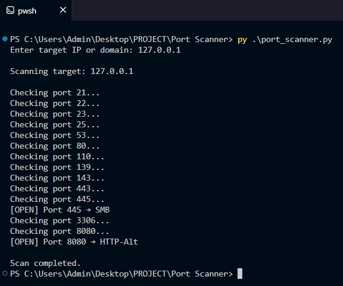

# Python Port Scanner 🔐

## 📌 Description
This is a simple Python-based port scanner that scans common ports and identifies open services on a target system.

## 🚀 Features
- Scans important ports only (fast)
- Identifies services (HTTP, SSH, etc.)
- Clean and readable output
- Error handling included

## 🛠️ Technologies Used
- Python
- Socket Library

## ▶️ How to Run
1. Run the script:
   python scanner.py
2. Enter target IP or domain

## ⚠️ Disclaimer
This project is for educational purposes only. Do not use it on unauthorized systems.

## 📸 Example Output

